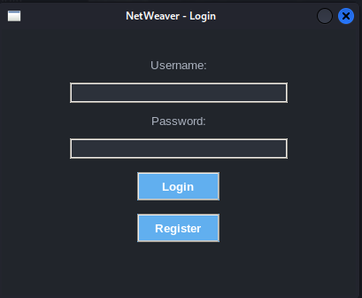
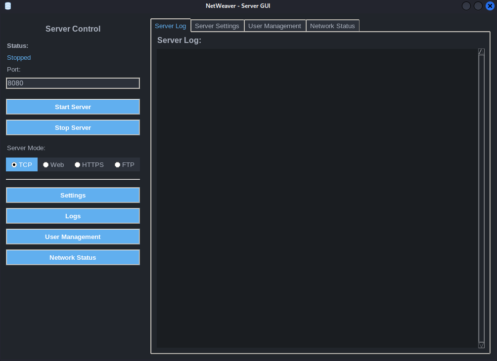

## NetWeaver2

NetWeaver is a multi-threaded server application with a modern, dark-themed graphical user interface (GUI) built using Tkinter. It supports various server modes including TCP, Web (HTTP), HTTPS, and FTP, along with user authentication and management.
Features

    Multi-threaded Server: Handles multiple client connections concurrently.
    Multiple Server Modes:
        TCP Server: Basic TCP communication.
        Web Server (HTTP): Serves static web content from a specified root directory.
        HTTPS Server: Secure web serving with SSL/TLS encryption (requires certificate and key files).
        FTP Server: Basic FTP operations (authentication, directory listing, file transfer).
    User Authentication System: Secure login and user management using bcrypt for password hashing.
    Intuitive GUI: Tkinter-based interface for easy server control, settings configuration, user management, and real-time logging.
    Real-time Logging: Displays server activities and connection information in a dedicated log area.
    Network Status Monitoring: Provides basic insights into network connections.

## Table of Contents
- [Pictures of NetWeaver2](#Pictures-of-NetWeaver2)
- [Setup and Installation](#Setup-and-Installation)
- [Running NetWeaver](#Running-NetWeaver)
- [Login and Registration](#Login-and-Registration)
- [Using NetWeaver Features](#Using-NetWeaver-Features)
- [Stopping NetWeaver](#Stopping-NetWeaver)
- [Contributing](#Contributing)
- [License](#Licence)

## Pictures of NetWeaver2

## Setup and Installation

To get NetWeaver up and running, follow these steps:

1. Clone the Repository
Bash
        
        git clone <repository-url>
        cd NetWeaver

2. Create a Virtual Environment

It's highly recommended to use a virtual environment to manage project dependencies.
Bash

        python -m venv venv

3. Activate the Virtual Environment

    On Windows:
    Bash

       .\venv\Scripts\activate

On macOS/Linux:
Bash

    source venv/bin/activate

4. Install Dependencies

NetWeaver requires the following Python packages:

    Pillow (for image handling in the GUI)
    bcrypt (for password hashing in user management)

Install them using pip:
Bash

    pip install Pillow bcrypt

## Running NetWeaver

Initial Launch and Security Warning

When you run main.py for the first time, a login window will appear. By default, a users.json file is created with an admin:admin credential for convenience.

SECURITY WARNING: For production environments or any setup requiring security, it is CRUCIAL to delete the users.json file immediately after the initial launch and register your own secure credentials through the application's user management interface.

To start the application:
Bash

    python main.py

## Login and Registration

    Upon launching, you will be presented with a login window.
    You can use the default admin:admin credentials (if users.json exists) to log in for the first time.
    Alternatively, you can click "Register" to create a new user account.
    Once authenticated, the main NetWeaver GUI will appear.
    It is recommeneded to delete users.json and register your own credentials.

User Data Encryption (users.json and encryption_key.key)

## Using NetWeaver Features

1. Server Control

The left sidebar of the GUI provides core server controls.

    Status: Displays the current status of the server (Stopped, Running).
    Port: Enter the port number on which the server will listen (e.g., 8080).
    Server Mode: Select the desired server type using the radio buttons:
        TCP: For generic TCP communication.
        Web: For serving HTTP content.
        HTTPS: For serving secure HTTP content using SSL/TLS.
        FTP: For file transfer protocol services.
    Start Server Button: Initiates the server in the selected mode and on the specified port.
    Stop Server Button: Shuts down the running server.

2. Server Settings

Access the "Settings" tab from the main notebook area. These settings are mode-specific.

    Web Root Directory (for Web/HTTPS modes):
        Click "Browse" to select the folder from which web files will be served.
        This directory will be the root for all web requests.
    FTP Root Directory (for FTP mode):
        Click "Browse" to select the folder that will serve as the root for FTP operations.
        FTP users will be restricted to this directory and its subdirectories.
    SSL Certificate and Key Files (for HTTPS mode):
        Click "Browse" for "SSL Certificate File" to select your .pem certificate file.
        Click "Browse" for "SSL Key File" to select your .pem key file.
        These are essential for enabling secure HTTPS connections.

3. User Management

Access the "User Management" tab from the main notebook area.

    Add New User:
        Enter a Username and Password in the respective fields.
        Click the "Add User" button.
        User data is stored in users.json with bcrypt-hashed passwords.
    Authenticate User:
        Enter a Username and Password in the respective fields.
        Click the "Authenticate User" button to verify credentials.

4. Server Logs

Access the "Logs" tab from the main notebook area.

    This tab displays real-time logs of server activities, including connections, requests, errors, and informational messages.
    Different log message types (info, success, warning, error) are color-coded for readability.

5. Network Status

Access the "Network Status" tab from the main notebook area.

    This tab provides basic information about active network connections related to the server.

## Stopping NetWeaver

To gracefully stop the NetWeaver server, click the "Stop Server" button in the sidebar of the GUI. This will shut down the server threads and close the listening socket.

If you close the GUI window directly while the server is running, the application will also attempt to shut down the server gracefully.
Project Structure (for Developers)

    main.py: Entry point of the application.
    gui.py: Contains the Tkinter GUI implementation (TCPServerGUI and LoginWindow).
    server_core.py: Manages the main server loop and spawns client handler threads for different modes.
    tcp_handler.py: Handles individual TCP client connections.
    web_handler.py: Handles HTTP/HTTPS client connections, serving files.
    ftp_handler.py: Handles FTP client connections, supporting basic FTP commands.
    user.py: Manages user authentication, including password hashing and loading/saving user data to users.json.
    constants.py: Stores global configuration flags and variables.
    users.json: (Generated at first run) Stores user credentials.
    assets/: Directory for application icons and other assets.

## Contributing

(This section is a placeholder. You can add guidelines for contributing to your project here.)
License

## Licence

This project is licensed under the The Unlicense. You are free to use, modify, and distribute this software for any purpose, without any conditions whatsoever.
